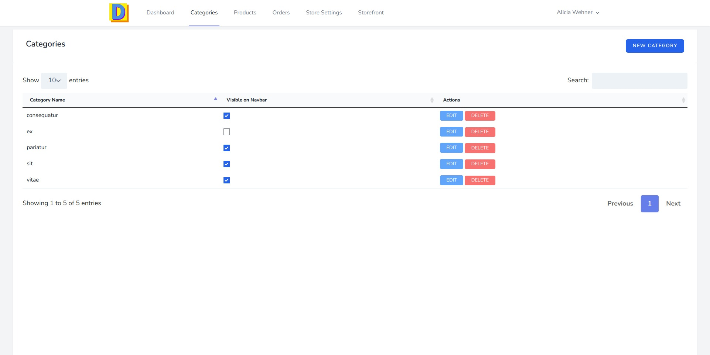
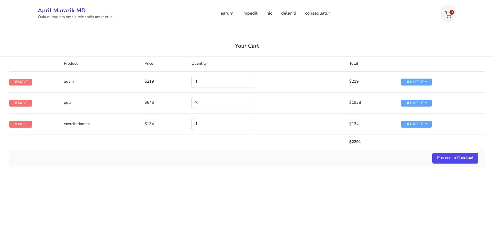

An easy way to build an online store. It allows clients to create an online storefront they can use to sell their products. 


## Features

### Clients(Storefront Owner)

- Create an online storefront
- Manage Products
- Manage Product categories
- Assign multiple categories to products
- Show/hide category on storefront navigation
- Manage orders and update order status
- Dashboard with statistics

### Admins

- Manage users and their stores
- Add another admins
- Delete or deactivate stores
- Login as clients and have an option to go back without reseting the admin session
- Dashboard with statistics

### Storefront Visitors

- Paginated product display
- Browse products by category
- Minicart (can delete products)
- Cart Page(can change product quantity and delete products)
- Checkout Page for placing an order


## Preview


### Admin


### Client





### Storefront





## Development

## running dev server using sail

- run composer install 

```
composer install

```

-   configure a bash alias

```
alias sail='[ -f sail ] && bash sail || bash vendor/bin/sail'

```

-   configure env variables (use the .env.example file)

-   run dev server

```
sail up

```

-   run migrations and seed

```
sail artisan migrate && sail artisan db:seed

```

default client:

email: client@example.com
password: password

default admin:

email: admin@example.com
password: password

-   link storage

```
 sail artisan storage:link

```


## License

MIT © [Eyuel Berga Woldemichael](https://github.com/eyuelberga)